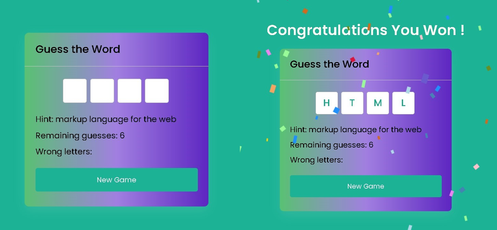

# JS-Project---Calendar

#### By Anand Kumar
This is a webpage based app Word Guessing Game.

## Table of contents

  - [Description](#description)
  - [Screenshot](#Screenshot)
  - [Tech-Stacks-Used](#Tech-Stacks-Used)
  - [What I learned](#what-i-learned)
  - [Links](#links) 
  - [Setup-Installation-Requirements](#Setup-Installation-Requirements)
  - [Useful resources](#useful-resources)
  - [Author](#author)

## Overview

### Description

This is web based live Game App of Word Guessing, and this is responsive by nature for big and small devices, with the use of frontend technologies.
- It is very interesting game & User can enhance his guessing skills.
- It allows user to guess the word with in limited guessing chance based on word length.
- Can See When you won the game celebration will be happened in background.
- User can change the background color randomly by clicking on New Game.
- When User loses, Game Over will be appear and correct word will be appeared.

### Screenshot

## Tech-Stacks-Used
   
- HTML5
- CSS3
- JavaScript

### What I learned

While doing this project I have implemented the Javascript functionality of checking right word from list of word and also implemented random color generating functionality, along with I learnt about confetti, different properties of Css. This Project really helped me to polish my css skills as well as JavaScript skills to render something which was running in my mind for combining present, past and future time. I also learnt to implement HTML,CSS,JavaScript to meet design expectation.

### Links

- Code URL     : [https://github.com/Anand-kumar96/Word_Guessing_Game)
- Live Site URL: [https://guess-word-project-by-anand.netlify.app/)

### Setup-Installation-Requirements
-  Clone this repo to your desktop
-  Naviagte to the top level of directory
-  Open index.html in your browser

### Useful resources

- [https://www.w3schools.com/](https://www.w3schools.com/) - This helped me for strengthening the fundamentals of HTML and CSS. it provides all the concept from scratch      level.
- [https://stackoverflow.com/](https://stackoverflow.com/) - This is an amazing website for solving your doubts and finding any different approaches. I always refer to it to learn different properties of css and javascript.

## Author
#### Anand Kumar
- Linkedin - [Anand-kumar96](https://www.linkedin.com/in/anand-kumar96/)
- GitHub -   [Anand-kumar96](https://github.com/Anand-kumar96)
